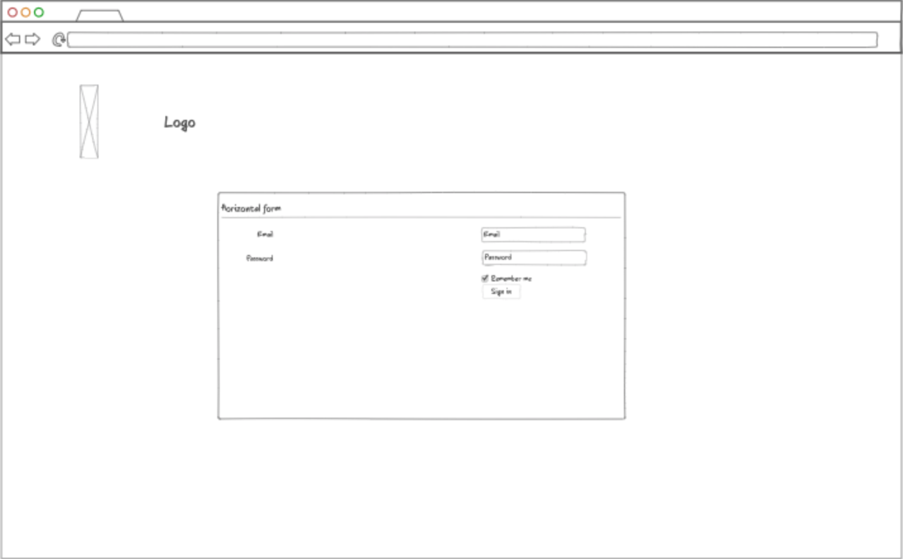
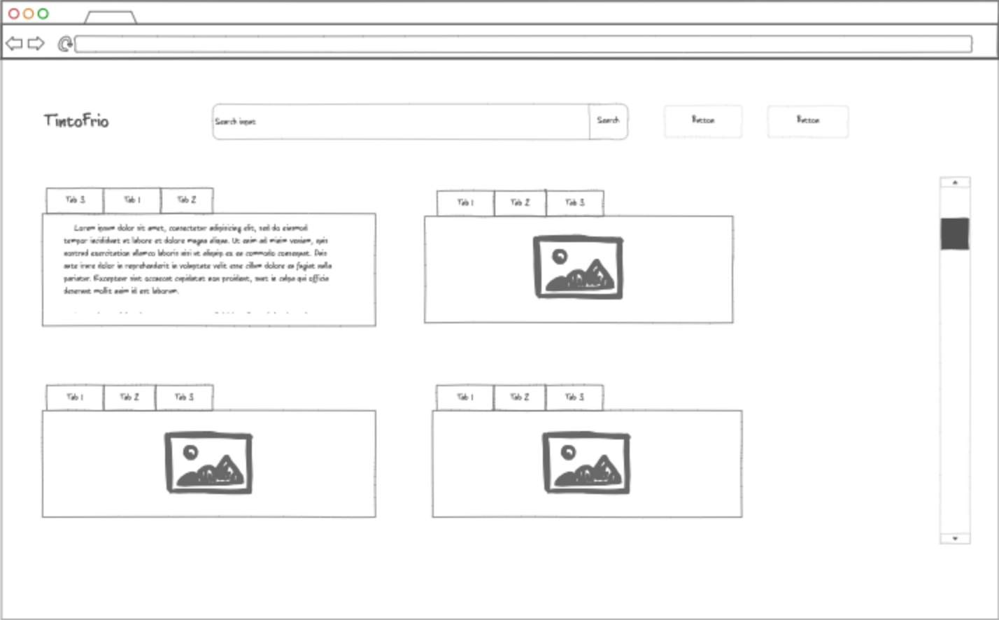
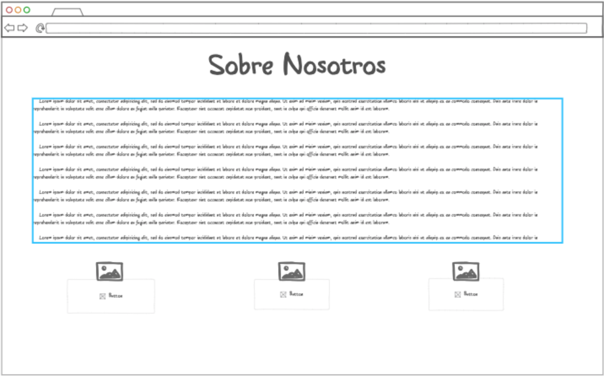
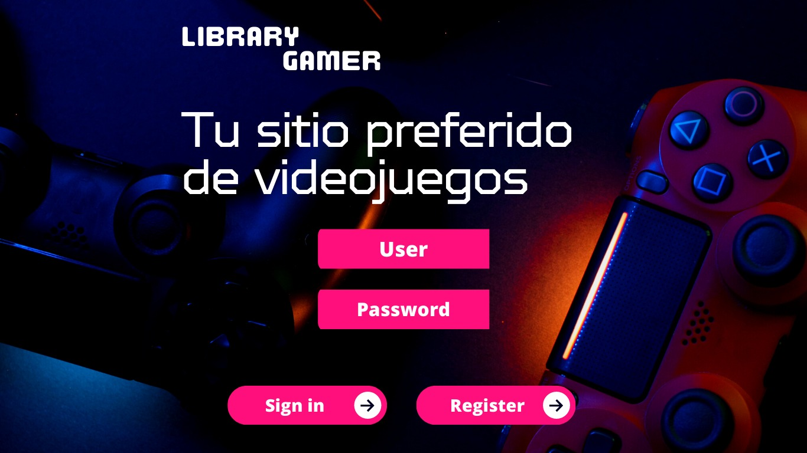
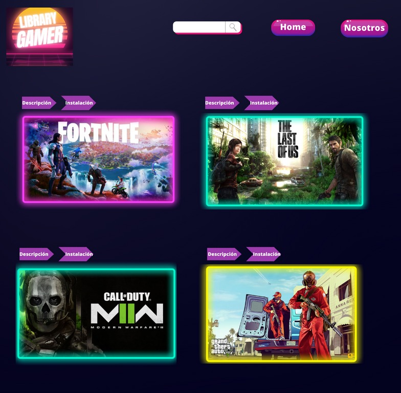
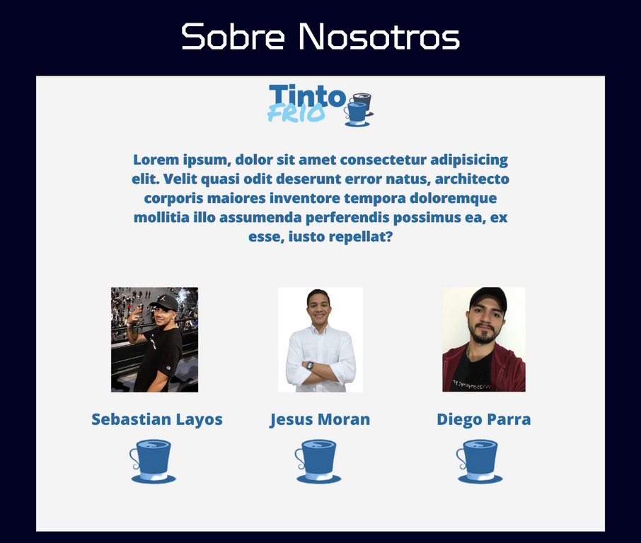
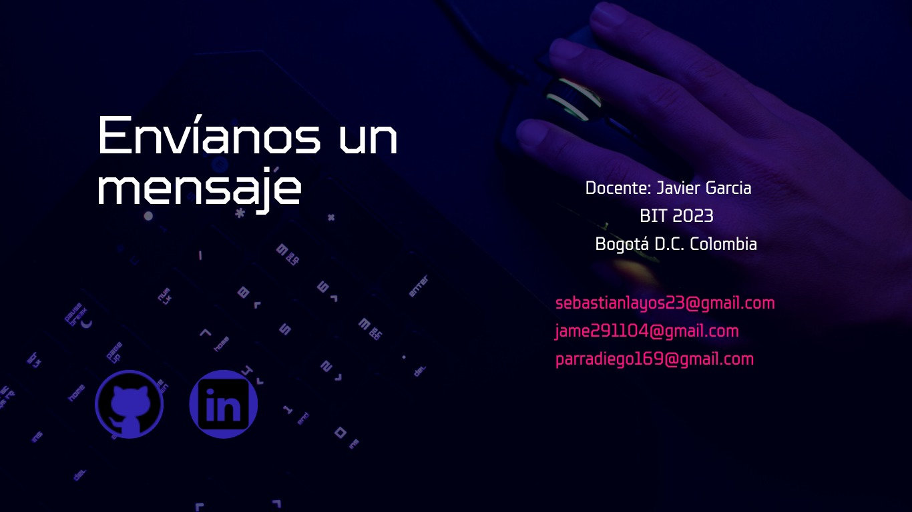
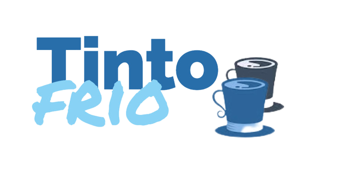

# Bit10team
## Gamer Library
### Descripción de la página:
Desde Gamer library sabemos que hablar de videojuegos no es referirse a un público infantil. Se debe mirar integralmente e incluir a distintos públicos y franjas etarias por ello queremos brindar un espacio agradable donde es posible conectarse con otras personas y visitar distintos sitios dentro de los videojuegos, de esta manera elegir que gamer serás; entendemos que la cultura digital es la práctica y no el objeto. El foco no está solamente en cómo muestro el juego, en qué veo, cómo lo ilumino o cómo lo instalo. Hay que pensar en cómo el usuario vive la experiencia.
### Autores
- Jesús Morán (Lider del equipo, encargado del repositorio y control de versiones en Git y Github)
- Diego Parra (Encargado de Los Wirefrime de baja y alta)
- Sebastián Layos (Encargado de la documentación del proyecto)
### Tecnologías
- HTML
- CSS
- JavaScript
- React
- Git
- GitHub
- Bootstrap
- React-bootstrap
- Canva
- Ninjamock
- Logos-edit
- Google Meet (reuniones diarias)
- Trello (Documentación)

### Wireframe Baja

### Wireframe Alta

### Estilos y colores TintoFrío Aplicativo Web
- #E8F9FD
- #79DAE8
- #0AA1DD
- #2155CD 

### Colores Game Library, aplicativo web.
- #ff0f7b
- #1a1a37
- #3023ae
- #ffffff

### Logo

