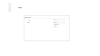
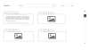
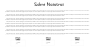

# Bit10team
## Gamer Library
### Descripción
El fundamento de este proyecto esta diseñado para demostrar nuestras capacidades con las tecnologias propuestas por BIT 2022 - 23.
### Autores
Jesús Morán (Lider del equipo, encargado del repositorio y control de versiones en Git y Github)
Diego Parra (Encargado de Los Wirefrime de baja y alta)
Sebastián Layos (Encargado de la documentación del proyecto)
### Tecnologías
- HTML
- CSS
- JavaScript
- React
- Git
- GitHub
- Bootstrap
- React-bootstrap

### Wireframe Baja

### Estilos y colores
- #E8F9FD
- #79DAE8
- #0AA1DD
- #2155CD